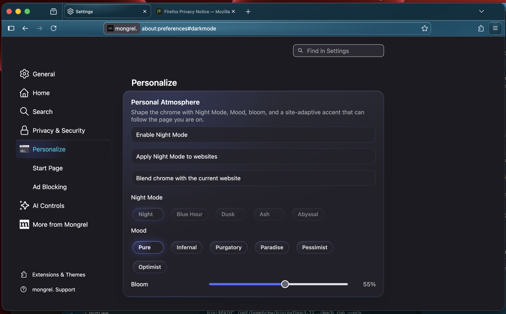
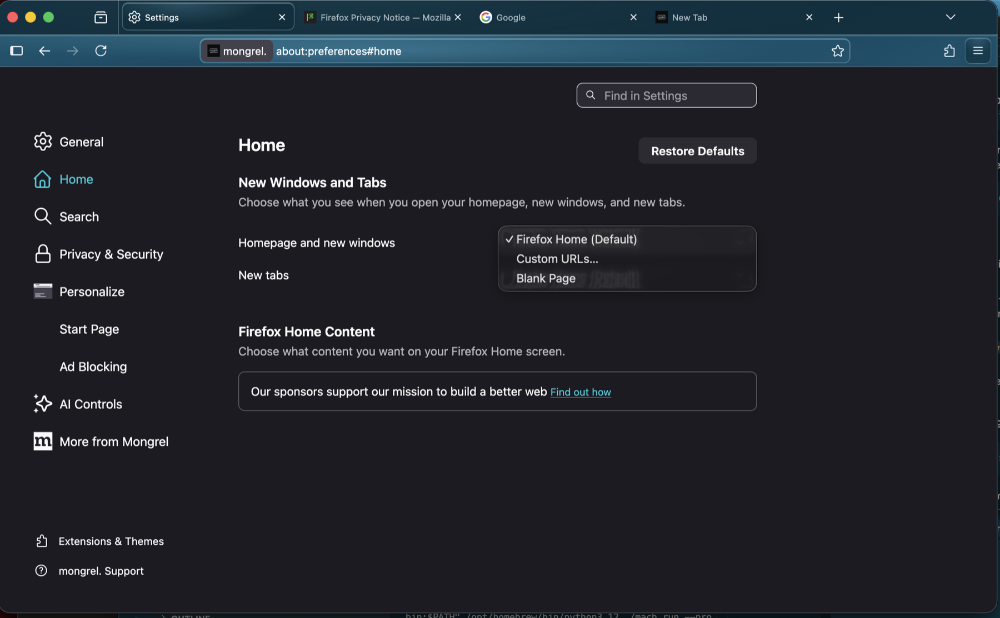
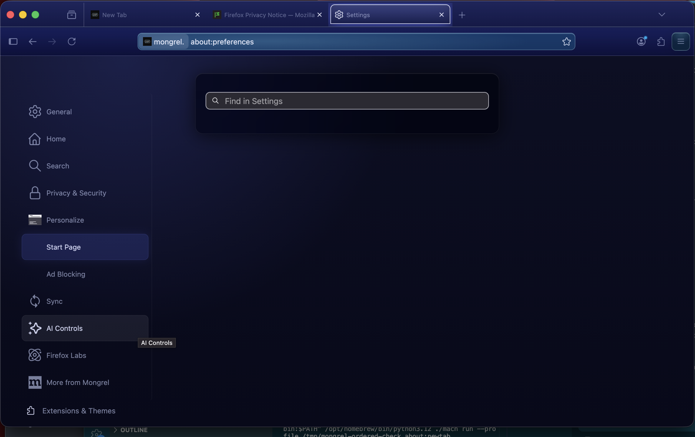
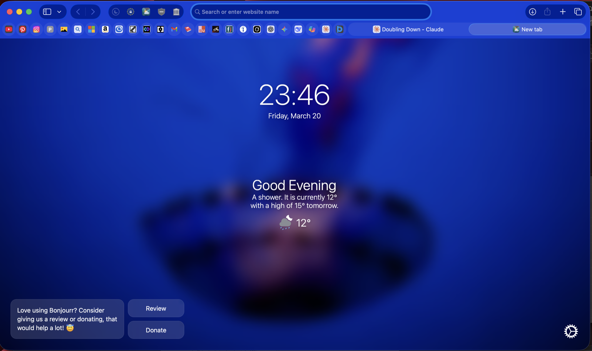

# Mongrel Browser

<p align="center">
  
</p>

<p align="center">
  A Firefox/Gecko browser experiment for macOS, exploring a calmer glass interface,
  a utility-first start page, and a deliberately reduced browser surface.
</p>

<p align="center">
  
  
  
  
</p>



## The short version

Mongrel is a real Gecko-based macOS browser fork—not a WebKit wrapper or a static UI concept. The work so far spans browser chrome, a native `about:newtab` component, preferences, privacy-oriented defaults, contextual tools, branding, packaging, and dogfood releases.

The distribution model is intentionally independent: a controlled, direct-distribution macOS app for known testers and collaborators, outside the Mac App Store. “Underground” describes the product posture—not a bypass of macOS security. Signed builds, notarization, checksums, explicit release provenance, and a controlled update channel remain the target.

This repository is the compact, GitHub-readable edition of that work. It keeps the Mongrel-authored source and the exact Firefox integration points while leaving the multi-gigabyte upstream Gecko checkout, local build products, certificates, and release binaries out of Git.

> [!IMPORTANT]
> This is a portfolio/source snapshot, not a production browser release. The latest preserved dogfood build was usable for development evaluation, but the source tree was still undergoing recovery and the overlay is tied to a Firefox `152.0a1` development snapshot. See [Project status](docs/PROJECT_STATUS.md).

## What is here

| Area | What you can inspect |
| --- | --- |
| Product UI | Custom start page, visual-system tokens, preference panes, chrome hooks, and branding |
| Browser features | Night mode, page-aware theme effects, image tools, media/player plumbing, opt-in image ad blocking, Tor process orchestration, and an experimental IPFS protocol handler |
| Firefox integration | Component registration, default preferences, new-tab redirector, context-menu hooks, localization, build flags, and packaging scripts |
| Evidence | Development screenshots, feature-removal notes, theme prototypes, release checksums, and an honest status ledger |
| Reconstruction | A version-guarded overlay script and build notes for a compatible Gecko tree |

Start with:

- [Architecture](docs/ARCHITECTURE.md) for how the pieces connect
- [Feature map](docs/FEATURES.md) for source ownership and maturity
- [Design direction](docs/DESIGN.md) for the visual rationale
- [Project status](docs/PROJECT_STATUS.md) for demonstrated, experimental, and blocked work
- [Building](docs/BUILDING.md) for the reconstruction path and its limitations
- [Direct distribution](docs/DISTRIBUTION.md) for the off-store trust and release model
- [Source provenance](docs/SOURCE_PROVENANCE.md) for how this consolidated snapshot was assembled
- [Project history](docs/PROJECT_HISTORY.md) for a legible account of the work completed

## Product direction

Mongrel's design phrase is **energy encased in glass**: dark and atmospheric, but quieter than a conventional neon theme. The browser aims to make common actions—searching, opening a tool, changing visual tone, downloading media—feel close at hand without turning the chrome into a dashboard.

The project has four recurring principles:

1. Preserve a standards-complete Gecko core.
2. Reduce product surfaces that do not fit the browser's purpose.
3. Make visual personality systematic rather than decorative.
4. Keep powerful or privacy-sensitive features opt-in and legible.

## Screenshots

### Personalization surface

Mongrel adds a dedicated area for night palettes, mood, bloom, and site-adaptive chrome.


### Integrated preferences

Start Page and Ad Blocking are first-class preference panes rather than hidden `about:config` switches.



### Start-page work in progress

This development capture documents integration and compositing work. It also shows why the repository labels this a prototype: the custom page was not rendering reliably in every build at this point.



### Visual target

The following is a design-direction reference, not a claim about the latest dogfood build.



## Repository map

```text
.
├── assets/                    # Renderable identity and development captures
├── docs/                      # Architecture, design, build, status, and history
├── evidence/benchmarks/       # Recorded removal work and CSS prototypes
├── firefox-overlay/           # Exact paths copied over a compatible Firefox tree
│   ├── browser/components/
│   │   ├── mongrel-startpage/
│   │   ├── mongrel-adblock/
│   │   └── mongrel-ipfs/
│   ├── browser/themes/
│   ├── modules/libpref/
│   └── tools/
├── release/                   # Checksums and release-record metadata, not binaries
└── scripts/                   # Overlay and repository-safety helpers
```

The overlay intentionally mirrors Mozilla's source-tree layout. That makes the integration reviewable: a reader can see both Mongrel-owned modules and the upstream files that register them.

## Try or reconstruct it

There are two distinct paths:

### Evaluate a dogfood build

The last preserved package record is `Mongrel-Dogfood-2026-05-08` for macOS. The DMG and app ZIP are deliberately not committed; they belong in GitHub Releases. Published files should be checked against [release/SHA256SUMS.txt](release/SHA256SUMS.txt).

This build used ad-hoc signing and did not carry the platform passkey entitlement. Treat it as an archival development build, not a security-hardened daily browser. The forward path is a controlled direct release, not Mac App Store submission.

### Reconstruct the source tree

The overlay targets a Firefox `152.0a1` development snapshot:

```bash
./scripts/apply-overlay.sh /path/to/firefox-152-source --check
./scripts/apply-overlay.sh /path/to/firefox-152-source --write
```

Then follow [docs/BUILDING.md](docs/BUILDING.md). Because the original checkout did not preserve an exact public upstream revision, reconstruction is **version-guarded but not bit-for-bit reproducible**. Pinning and publishing the precise Gecko base is the highest-priority repository follow-up.

## Current status at a glance

| Track | State | Evidence |
| --- | --- | --- |
| Custom identity and macOS chrome | Demonstrated | Screenshots and branding overlay |
| Start-page component architecture | Implemented in source | `mongrel-startpage/` modules and registration |
| Preference panes | Implemented in source | Start Page, Personalize, and Ad Blocking integrations |
| Dogfood packaging | Demonstrated | May 8 package record and checksums |
| Clean build from a fresh public clone | Not yet demonstrated | Original live tree was still being restored |
| Controlled direct distribution | Architecture adopted; hardening pending | Private/restricted releases with signed artifacts and checksums |
| Developer ID signing/notarization | Not demonstrated | Desired for trusted off-store distribution, not App Store compliance |
| Passkeys/Touch ID | Experimental | Entitlement tooling exists; absent from standard dogfood package |
| Extended everyday stability | In progress | Multi-day dogfood hardening remained the active phase |

The fuller matrix is in [docs/PROJECT_STATUS.md](docs/PROJECT_STATUS.md).

## Scope and attribution

Mongrel incorporates and modifies Mozilla Firefox source. The overlay is distributed under the Mozilla Public License 2.0; individual files retain their existing notices. Mozilla trademarks and the Firefox name/logo are not licensed for reuse. Mongrel's own branding is used to distinguish the experiment from Mozilla Firefox.

No certificates, provisioning profiles, private keys, local profiles, logs, build directories, or packaged applications are included here.

## Contributing and security

This snapshot is most useful for source review, design critique, documentation, and work toward a pinned upstream base. Read [CONTRIBUTING.md](CONTRIBUTING.md) before proposing code changes. Please report security issues through the private process described in [SECURITY.md](SECURITY.md), not a public issue.

## License

The source is covered by MPL 2.0 notices and the upstream Firefox licensing structure. See [LICENSE](LICENSE) and the notices within individual files.
